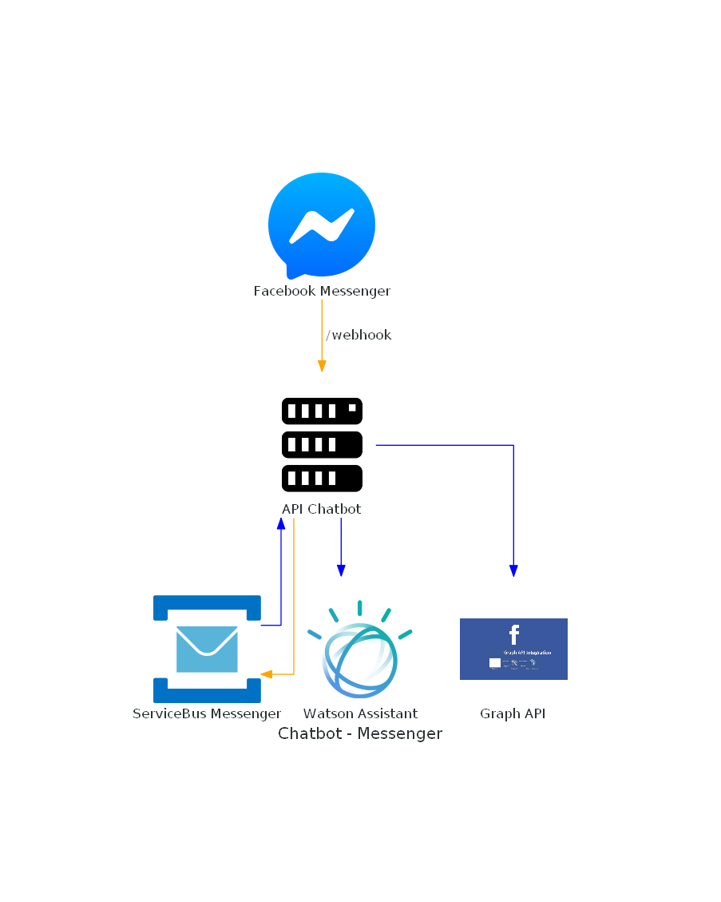

<!--
*** Thanks for checking out the Best-README-Template. If you have a suggestion
*** that would make this better, please fork the repo and create a pull request
*** or simply open an issue with the tag "enhancement".
*** Thanks again! Now go create something AMAZING! :D
-->


<!-- PROJECT SHIELDS -->
<!--
*** I'm using markdown "reference style" links for readability.
*** Reference links are enclosed in brackets [ ] instead of parentheses ( ).
*** See the bottom of this document for the declaration of the reference variables
*** for contributors-url, forks-url, etc. This is an optional, concise syntax you may use.
*** https://www.markdownguide.org/basic-syntax/#reference-style-links
-->
[![Contributors][contributors-shield]][contributors-url]
[![Forks][forks-shield]][forks-url]
[![Stargazers][stars-shield]][stars-url]
[![Issues][issues-shield]][issues-url]
[![MIT License][license-shield]][license-url]
[![LinkedIn][linkedin-shield]][linkedin-url]
[![LinkedIn][linkedin-shield]][linkedin-url-daniel]


<!-- PROJECT LOGO -->
<br />
<p align="center">

  <h1 align="center">Desenvolvendo Chatbot com IA</h1>

  <p align="center">
    Repositório de exemplo para live MRV + Digital Innovation one
    <br />
    <a href="https://github.com/MagnoSantos/chatbot-api/issues">Report Bug</a>
    ·
    <a href="https://github.com/MagnoSantos/chatbot-api/issues">Request Feature</a>
  </p>
</p>


<!-- TABLE OF CONTENTS -->
<details open="open">
  <summary>Indice</summary>
  <ol>
    <li>
      <a href="#descrição">Descrição</a>
      <ul>
        <li><a href="#feito-com">Feito Com</a></li>
      </ul>
    </li>
    <li>
      <ul>
        <li><a href="#requisitos">Requisitos</a></li>
        <li><a href="#executando-local">Executando Local</a></li>
      </ul>
    </li>
    <li><a href="#licença">Licença</a></li>
    <li><a href="#contato">Contato</a></li>
    <li><a href="#bibliografia">Bibliografia</a></li>
  </ol>
</details>

<!-- Descrição -->
## Descrição


Este repositório serve de exemplo para a live Desenvolvendo um Chatbot com IA.

Ele contempla uma API simples que comunica-se com o canal digital Facebook Messenger e integra-se com o motor de inteligência IBM Watson Assistant. 

### Feito Com

* [.net Core](https://dotnet.microsoft.com/download/dotnet/3.1)
* [Azure Cloud](https://portal.azure.com/)

### Requisitos

É necessário ter o sdk do [.net Core](https://dotnet.microsoft.com/download/dotnet/3.1) instalado. Além disso uma conta microsoft deve ser criada tanto no [Azure Cloud](https://portal.azure.com/). Para configuração do Facebook Messenger Plataforma, além de uma conta no Facebook, é necessário ter um aplicativo cadastrado no [Facebook For Developers](https://developers.facebook.com/apps/).

### Executando Local

1. Clonar o repositório
   ```sh
   git clone git@github.com:MagnoSantos/chatbot-api.git
   ```
2. Copilar e executar a aplicação
   ```sh
   cd src
   dotnet run
   ```

<!-- BIG PICTURE -->
### Big Picture



<!-- LICENSE -->
## Licença

Distribuido sob a licença MIT License. Veja `LICENSE` para mais informações.

<!-- CONTACT -->
## Contato

* Magno Santos - [@MagnoSantos](https://www.linkedin.com/in/magno-juliano-santos/) 
* Daniel Martinez - [@DanielMartinez](https://www.linkedin.com/in/daniel-martinez-ai/)

<!-- ACKNOWLEDGEMENTS -->
## Bibliografia
* [Tutorial: criar uma API Web com o ASP.NET Core](https://docs.microsoft.com/pt-br/aspnet/core/tutorials/first-web-api?view=aspnetcore-5.0&tabs=visual-studio)
* [Flurl is a modern, fluent, asynchronous, testable, portable, buzzword-laden URL builder and HTTP client library for .NET](https://flurl.dev/)
* [Messenger Platform - Facebook for Developers](https://developers.facebook.com/docs/messenger-platform/reference/)
* [Watson Assistant: um chatbot inteligente, seu melhor assistente virtual](https://www.ibm.com/br-pt/cloud/watson-assistant)


<!-- MARKDOWN LINKS & IMAGES -->
<!-- https://www.markdownguide.org/basic-syntax/#reference-style-links -->
[contributors-shield]: https://img.shields.io/github/contributors/MagnoSantos/chatbot-api.svg?style=for-the-badge
[contributors-url]: https://github.com/MagnoSantos/chatbot-api/graphs/contributors
[forks-shield]: https://img.shields.io/github/forks/MagnoSantos/chatbot-api.svg?style=for-the-badge
[forks-url]: https://github.com/MagnoSantos/chatbot-api/network/members
[stars-shield]: https://img.shields.io/github/stars/MagnoSantos/chatbot-api.svg?style=for-the-badge
[stars-url]: https://github.com/MagnoSantos/chatbot-api/stargazers
[issues-shield]: https://img.shields.io/github/issues/MagnoSantos/chatbot-api.svg?style=for-the-badge
[issues-url]: https://github.com/MagnoSantos/chatbot-api/issues
[license-shield]: https://img.shields.io/github/license/MagnoSantos/chatbot-api.svg?style=for-the-badge
[license-url]: https://github.com/MagnoSantos/chatbot-api/blob/main/LICENSE
[linkedin-shield]: https://img.shields.io/badge/-LinkedIn-black.svg?style=for-the-badge&logo=linkedin&colorB=555
[linkedin-url]: https://www.linkedin.com/in/magno-juliano-santos/
[linkedin-shield]: https://img.shields.io/badge/-LinkedIn-black.svg?style=for-the-badge&logo=linkedin&colorB=555
[linkedin-url-daniel]: https://www.linkedin.com/in/daniel-martinez-ai/
